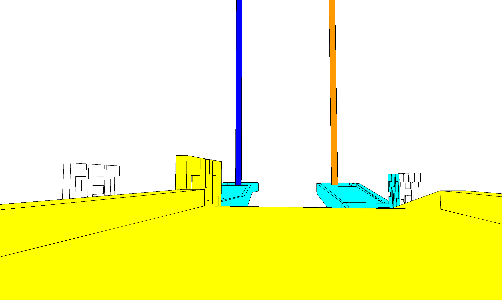

V

Author: (TODO: your name)

Design: (TODO: In two sentences or fewer, describe what is new and interesting about your game.)

Screen Shot:

How To Play:

(TODO: describe the controls and (if needed) goals/strategy.)

Sources:

Zoom in sound from freesounds.com:
https://freesound.org/people/sheepfilms/sounds/154795/
This work is licensed under the Creative Commons 0 License.

Background music:
Abyss by | e s c p | https://escp-music.bandcamp.com
Music promoted by https://www.free-stock-music.com
Attribution 4.0 International (CC BY 4.0)
https://creativecommons.org/licenses/by/4.0/

This game was built with [NEST](NEST.md).
